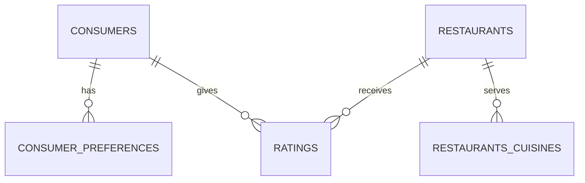

# Restaurant Rating Analysis: Where Should You Invest in a Restaurant?

## Description

Imagine you have money to invest in a restaurant business, but you do not know which cuisine to pick, which features to go for, or whether customer taste really affects how they rate a restaurant. This project answers those questions using a real restaurant rating survey from Mexico.

The data was cleaned and modeled in PostgreSQL, then turned into a five page interactive dashboard in Power BI. The dashboard answers four business questions from the client and gives clear, data backed direction on where and what to invest in.

---

## Table of Contents

1. [Business Problem and Client Overview](#1-business-problem-and-client-overview)
2. [Dataset Description](#2-dataset-description)
3. [Data Model and Table Relationships](#3-data-model-and-table-relationships)
4. [Tools and Technologies](#4-tools-and-technologies)
5. [Skills Explored](#5-skills-explored)
6. [Data Cleaning Process](#6-data-cleaning-process)
7. [DAX Measures](#7-dax-measures)
8. [Dashboard Pages](#8-dashboard-pages)
9. [Key Findings](#9-key-findings)
10. [Summary and Conclusion](#10-summary-and-conclusion)
11. [Recommendations](#11-recommendations)
12. [Caveats and Limitations](#12-caveats-and-limitations)
13. [How to Explore This Project](#13-how-to-explore-this-project)
14. [About Me and Contact](#14-about-me-and-contact)
---

## 1. Business Problem and Client Overview

Digitaley Drive gave this project as a capstone task. The brief explained that a customer survey was carried out in Mexico in 2012 to collect information about restaurants, their cuisines, and the consumers who visit them. As the data analyst on this project, the task was to analyze the dataset and provide answers that would help business entrepreneurs and investors make more informed decisions.

The client asked four specific questions:

1. What can you learn from the highest rated restaurants? Do consumer preferences have an effect on ratings?
2. What are the consumer demographics? Does this indicate a bias in the data sample?
3. Are there any demand and supply gaps that can be exploited in the market?
4. If you were to invest in a restaurant, which characteristics would you be looking for?

Put simply, the four questions ask: who are the customers, what do they want, where is the gap in the market, and what should an investor look for.

*Figure 1: Digitaley Drive project brief*

---

## 2. Dataset Description

The dataset comes from a customer survey carried out in Mexico in 2012. It covers two sides of the restaurant market: the customers (who they are and which cuisines they prefer) and the restaurants (what they offer). A ratings table connects the two sides by recording how each consumer rated the restaurants they visited.

The dataset has five tables. The ratings cover 138 consumers, 130 restaurants, and 1,161 individual ratings. All three rating columns use a scale from 0 to 2, where 2 is the best.

| Table | What it contains | Side of the market |
|---|---|---|
| Consumers | Profile of each consumer, such as age, occupation, budget, and location | Customer |
| Consumer_Preferences | The cuisines each consumer says they prefer. One consumer can have more than one | Customer |
| Restaurants | Location and features of each restaurant, such as price, parking, and alcohol service | Restaurant |
| Restaurants_Cuisines | The cuisines each restaurant serves. One restaurant can serve more than one | Restaurant |
| Ratings | The scores each consumer gave to each restaurant they visited | Links both sides |

### Data Dictionary

**Consumers**

| Column | Description |
|---|---|
| Consumer_ID | Unique ID for each consumer |
| City | City where the consumer lives |
| State | State where the consumer lives |
| Country | Country where the consumer lives |
| Latitude | Latitude of the consumer's location |
| Longitude | Longitude of the consumer's location |
| Smoker | Whether the consumer smokes |
| Drink_Level | How much alcohol the consumer drinks |
| Transportation_Method | How the consumer usually gets around, for example public transport or a personal car |
| Marital_Status | Marital status of the consumer |
| Children | Whether the consumer has children or dependents |
| Age | Age of the consumer in years |
| Occupation | Main occupation of the consumer, for example student or employed |
| Budget | Spending level of the consumer: Low, Medium, or High |

**Consumer_Preferences**

| Column | Description |
|---|---|
| Consumer_ID | The consumer this preference belongs to |
| Preferred_Cuisine | A cuisine the consumer says they prefer. One consumer can have several |

**Restaurants**

| Column | Description |
|---|---|
| Restaurant_ID | Unique ID for each restaurant |
| Name | Name of the restaurant |
| City | City where the restaurant is located |
| State | State where the restaurant is located |
| Country | Country where the restaurant is located |
| Zip_Code | Postal code of the restaurant |
| Latitude | Latitude of the restaurant's location |
| Longitude | Longitude of the restaurant's location |
| Alcohol_Service | Type of alcohol served, for example Full Bar, Wine & Beer, or None |
| Smoking_Allowed | Smoking policy of the restaurant |
| Price | Price level of the restaurant: Low, Medium, or High |
| Franchise | Whether the restaurant is part of a franchise (Yes or No) |
| Area | Type of restaurant space, for example open or closed |
| Parking | Parking option, for example Valet, Public, Yes, or None |

**Restaurants_Cuisines**

| Column | Description |
|---|---|
| Restaurant_ID | The restaurant this cuisine belongs to |
| Cuisine | A cuisine the restaurant serves. One restaurant can serve several |

**Ratings**

| Column | Description |
|---|---|
| Consumer_ID | The consumer who gave the rating |
| Restaurant_ID | The restaurant that was rated |
| Overall_Rating | Overall score, from 0 to 2 |
| Food_Rating | Score for the food, from 0 to 2 |
| Service_Rating | Score for the service, from 0 to 2 |

**Columns added during the analysis**

| Column | Where it was added | What it does |
|---|---|---|
| Age_Group | Consumers | Groups age into 18-25, 26-35, 36-45, and 46+ |
| Primary_Cuisine | Restaurants | Gives each restaurant one cuisine (the first one in alphabetical order), so cuisine level ratings can be compared without repeating rating rows |
| Preference_Match | Ratings | Shows Match when the consumer's preferred cuisine is one of the cuisines the restaurant serves, and No Match when it is not |
| Demand_Supply_Gap | Cuisines | Number of consumers who prefer a cuisine minus the number of restaurants that serve it |

*Figure 2: Raw dataset sample*

---

## 3. Data Model and Table Relationships

The data follows a simple star style model. Ratings is the center table, because it is the only table that holds both a Consumer_ID and a Restaurant_ID. Consumers and Restaurants sit on either side of it, and each one has an extra table for the cuisines linked to it.

| From table | To table | Joined on | Relationship |
|---|---|---|---|
| Consumers | Consumer_Preferences | Consumer_ID | One to many |
| Consumers | Ratings | Consumer_ID | One to many |
| Restaurants | Restaurants_Cuisines | Restaurant_ID | One to many |
| Restaurants | Ratings | Restaurant_ID | One to many |

Primary keys and foreign keys were added in PostgreSQL. This means the database itself blocks any rating that points to a consumer or restaurant that does not exist.

**Two design decisions that are worth knowing:**

1. **All joins were done in SQL, not in Power BI.** The tables were combined into ready made views in PostgreSQL and then loaded into Power BI. Because of this, the views in Power BI are not linked to each other, and this is on purpose. Each view already holds everything the pages using it need.
2. **Many to many relationships were handled with care.** A consumer can prefer several cuisines, and a restaurant can serve several cuisines. Joining both directly to the ratings table would repeat the same rating many times and give wrong averages. To avoid this, the preference match was checked with an EXISTS test, so one rating always stays as one row. Each restaurant was also given one primary cuisine for cuisine level rating charts. After each view was built, its row count was compared with the ratings table to prove that no rows were duplicated.

| View | What it combines | Used for |
|---|---|---|
| core_analysis | Ratings, Consumers, Restaurants, and each restaurant's primary cuisine | Consumer profile, ratings, and restaurant feature charts (Pages 1, 2, 3, and 5) |
| preference_match_analysis | Ratings with a Match or No Match flag | Preference match KPIs and chart (Page 3) |
| demand_supply_gap | Cuisine demand counts and cuisine supply counts, side by side | Demand and supply charts (Pages 1, 3, and 4) and part of the Best Investment Cuisine measure (Page 5) |
| restaurant_primary_cuisine | One cuisine for each restaurant | Feeds the primary cuisine column in core_analysis |

*Figure 3: Table relationships sample (ER diagram)*

---

## 4. Tools and Technologies

| Tool | What it was used for |
|---|---|
| PostgreSQL and pgAdmin | Data cleaning, constraints, joins, and building views |
| Power BI Desktop | Data modeling, visuals, slicers, and page navigation |
| DAX | Measures for KPIs, rankings, and comparisons |
| Microsoft Excel | A quick first look at the raw files before moving to SQL |
| PowerPoint | Wireframe and layout design, including the navigation bar, before building in Power BI |
| Flaticon | Icons for the KPI cards and navigation bar |
| Color Picker | Picking and matching colors so the dashboard theme stays consistent |
| GitHub | Project documentation |

---

## 5. Skills Explored

**Technical skills**

- Data cleaning and validation in SQL: null values, duplicates, orphan records, inconsistent text, and invalid values
- Database design with primary keys, foreign keys, and table relationships
- Writing SQL views and calculated columns
- Handling many to many relationships without duplicating rows
- Creating backups before changing data
- Writing DAX measures for KPIs, rankings, and comparisons
- Using distinct counts so that numbers are not inflated

**Analytical skills**

- Turning business questions into a step by step analysis plan
- Checking a data sample for bias
- Comparing demand against supply to find market gaps
- Testing results and fixing errors, for example fixing a measure that returned the same value for both Match and No Match

**Design and communication skills**

- Wireframing a dashboard layout in PowerPoint before building it
- Dashboard design: color theme, icons, consistent titles, slicers, and page navigation
- Writing insights in plain language for a non technical client
- Documenting a project clearly on GitHub

---

## 6. Data Cleaning Process

All cleaning was done in PostgreSQL. **The original data was never cleaned directly.** The steps below were followed in order.

1. **Backup first.** A copy of all five tables was created before any cleaning started, so the original data could always be restored.
2. **Investigate before fixing.** Every table was checked for **null values, duplicate rows, character inconsistencies** (extra spaces and capital letters), **orphan records** (ratings that point to a consumer or restaurant that does not exist), and **invalid values** such as unrealistic ages or ratings outside the scale.
3. **Record the findings, then fix them.** Nothing was changed until every issue was written down.
4. **Check again.** The same checks were run after the fixes to confirm that every issue was gone.
5. **Verify data types.** Age and ratings were confirmed as whole numbers, coordinates as decimals, and ID columns were confirmed to have the same type in every table that uses them.
6. **Add primary and foreign keys.** This was done only after the data was clean, since the keys would fail on bad records.
7. **Test the relationships.** Sample joins across all five tables were run to confirm they link correctly.
8. **Add calculated columns and views.** Age_Group, Primary_Cuisine, Preference_Match, and Demand_Supply_Gap were created, then the three views were built for Power BI.
9. **Verify every view.** The row count of each view was compared with the ratings table to confirm that no rows were duplicated.

**What the checks found**

| Check | What was found | Action taken |
|---|---|---|
| Null values | **Consumers:** Smoker (3), Transportation_Method (7), Marital_Status (4), Children (11), Occupation (7), Budget (7). **Restaurants:** Zip_Code (20). The other three tables had none | Labeled as **Unknown** |
| Duplicate rows | None found | No action needed |
| Character inconsistencies | None found | No action needed |
| Orphan records | None found. The foreign keys were added with no errors | No action needed |
| Data types | Correct, and matching across tables | No action needed |

**Why missing values were labeled "Unknown" and not guessed**

Every missing value was in an opinion or lifestyle field, such as smoker, marital status, occupation, or budget. There is no correct value to fill in for these. Filling them with the most common answer would push the demographic charts toward that answer and hide the truth. Labeling them Unknown keeps the data honest, and Unknown then shows up in the charts as its own small group. Zip_Code was not used in any part of the analysis, so its missing values had no effect.

*Figure 4: SQL data cleaning and table creation*

*Figure 4: SQL data cleaning sample*

*Figure 4: SQL data cleaning and view creation*

*Figure 4: SQL data cleaning and view creation*

---

## 7. DAX Measures

Each measure was built to support a specific client question.

| Page | Measure | Why it was chosen |
|---|---|---|
| Overview | Total Consumers, Total Restaurants, Average Overall Rating, Total Cuisine Types, Most Preferred Cuisine | Gives the client a quick picture of the size of the market before any detail |
| Consumers (Q2) | Average Age, Most Common Occupation, Most Common Budget | Describes who the consumers really are, which is needed to judge bias in the sample |
| Preferences (Q1) | Highest Rated Restaurant | Shows which restaurant is on top. If two restaurants tie, the one with more ratings wins |
| Preferences (Q1) | Average Rating (Matched Cuisine), Cuisine Match Rate (%) | Tests whether getting a preferred cuisine improves ratings, and shows how often it even happens |
| Opportunity (Q3) | Highest Demand Cuisine, Most Available Cuisine, Largest Gap Cuisine, Largest Gap Value | Measures the difference between what customers want and what restaurants supply |
| Investment (Q4) | Best Investment Cuisine | Ranks every cuisine twice, once by average rating and once by market gap, then adds the two ranks together. The cuisine with the lowest total wins. This makes sure the pick is good on both quality and opportunity, not just one |
| Investment (Q4) | Best Price Category, Target Customer | Shows which price level and which type of customer are linked to the highest ratings |

**Important note:** the consumer charts (age, occupation, budget, and location) count **distinct consumers**, not ratings. This matters because one consumer can rate many restaurants. Counting ratings would make the same person appear many times and inflate the numbers.

*Figure 5: DAX measures in Power BI*

---

## 8. Dashboard Pages

The dashboard has five pages. A live link is not available, so please see [How to Explore This Project](#13-how-to-explore-this-project) to download and open the file. Screenshots of every page are shown below.

**A note on repeated charts:** a few charts appear on more than one page. This is on purpose, since the same data answers different questions on different pages.

- **Consumer Demand by Cuisine Type** appears on Pages 1, 3, and 4. On Page 1 it is part of the overview. On Page 3 it shows what customers want next to how restaurants perform. On Page 4 it is the demand side of the demand and supply comparison.
- **Consumer Distribution by Budget Level** appears on Pages 1 and 2. On Page 1 it is part of the overview. On Page 2 it is used to check for bias in the sample.

### Page 1: Overview

This page gives a quick summary of the whole dataset before going into detail on the other pages.

*Figure 6: Overview dashboard page*

The dataset covers 138 consumers and 130 restaurants across 101 cuisine types, with an average overall rating of 1.20. Most consumers are young and mostly students, and Mexican is by far the most preferred cuisine, with 97 consumers choosing it compared to 11 for American, the next closest. The following pages break down who these customers are, what affects their ratings, where the biggest market gap is, and what to look for when investing in a restaurant.

---

### Page 2: Consumers

**Client Question:** What are the consumer demographics? Does this indicate a bias in the data sample?

*Figure 7: Consumer demographic dashboard page*

Yes, the data shows a clear bias. Most consumers are between 18 and 25 years old, mostly students, and fall under the Medium budget category. They are also concentrated in a few cities, mainly San Luis Potosi, with much smaller numbers from Ciudad Victoria, Cuernavaca, and Jiutepec. This means the data does not fully represent all restaurant customers in Mexico. It mainly reflects young, student, budget-conscious consumers from a narrow set of cities, and this should be considered when using this data to make decisions.

---

### Page 3: Preferences

**Client Question:** What can you learn from the highest rated restaurants? Do consumer preferences have an effect on ratings?

*Figure 8: Consumer preferences and restaurant performance dashboard page*

The highest rated restaurants, Emilianos, Michiko, and Las Mananitas, all scored 2.0, and most of them fall under Brewery and Contemporary cuisine types, not Mexican, which is the most demanded. Interestingly, getting a customer's preferred cuisine does not improve their rating. Restaurants that matched a customer's preference scored 1.11 on average, while restaurants that did not match scored higher at 1.22. Also, only 18.9% of visits actually matched a customer's preferred cuisine. This shows that customer satisfaction is not really about getting their favorite food type. Something else, like food quality or service, likely plays a bigger role.

Note: this page uses "Cuisine" to describe what a restaurant actually serves, while it also shows "Cuisine Demand," which describes what consumers say they prefer. These are two different things measured on the same page, one from the restaurant side and one from the customer side.

---

### Page 4: Opportunity

**Client Question:** Are there any demand and supply gaps that can be exploited in the market?

*Figure 9: Market opportunity dashboard page*

Yes, there is a clear gap worth exploiting. Mexican cuisine has the highest demand, with 97 consumers wanting it, but only 28 restaurants currently serve it. This leaves a gap of 69, which is much higher than every other cuisine, where the gap is usually around 6 or 7. This makes Mexican cuisine the biggest and clearest opportunity in this market.

---

### Page 5: Investment

**Client Question:** If you were to invest in a restaurant, which characteristics would you be looking for?

*Figure 10: Investment characteristics dashboard page*

The data shows that higher priced restaurants tend to perform better. High priced restaurants scored 1.26 compared to 1.07 for low priced ones. Restaurants with a full bar scored higher than those with no alcohol service, and restaurants with valet parking scored higher than those with public parking. Family cuisine came out as the best overall investment option because it balances both rating and market opportunity, even though Brewery rated higher on its own but lacks enough demand. Based on this, the best restaurant to invest in would be a high priced, Family cuisine restaurant with full bar service and valet parking, targeting employed customers.

Note: this page shows "Family" as the best cuisine, while Page 3 shows "Brewery" as the highest rated cuisine. Both numbers are correct. Page 3 only looks at rating quality, while Page 5 combines rating quality together with market demand, since a good investment decision needs both.

---

## 9. Key Findings

- The consumer sample is biased toward young, student, budget-conscious consumers concentrated mainly in San Luis Potosi. Any conclusion from this data should be read with that in mind.
- The highest rated restaurants are Brewery and Contemporary style restaurants, not Mexican, even though Mexican is the most demanded cuisine.
- Matching a customer's preferred cuisine does not improve their rating. In fact, unmatched visits scored slightly higher on average. Something other than cuisine preference is driving satisfaction.
- Mexican cuisine has the largest demand and supply gap in the market, at 69, making it the clearest business opportunity by a wide margin.
- Higher priced restaurants, restaurants with a full bar, and restaurants with valet parking all tend to score higher.
- Family cuisine is the strongest overall investment choice once both rating quality and market demand are considered together, even though it does not have the single highest rating on its own.

---

## 10. Summary and Conclusion

This project set out to answer four questions using a restaurant rating dataset from Mexico. The data shows that the sample leans toward a young, student population, which limits how far its findings can be generalized. Despite this, clear patterns emerged. Customer satisfaction is not driven by getting a preferred cuisine, but likely by service and execution. Mexican cuisine has the biggest gap between demand and supply, making it a strong opportunity area. When it comes to investment, price level, alcohol service, and parking availability all show a consistent link to higher ratings, and Family cuisine stands out as the most balanced investment choice.

---

## 11. Recommendations

- Consider Mexican cuisine restaurants first, since this is where customer demand is highest and supply is lowest.
- If choosing based on overall performance and demand together, Family cuisine is the safer investment.
- Prioritize a higher price positioning, full bar service, and valet parking, since these features are consistently linked to higher customer ratings.
- Do not assume that matching a specific cuisine trend will automatically lead to better ratings. Focus more on service quality and overall restaurant execution.

---

## 12. Caveats and Limitations

- The consumer sample is not representative of the general population. It leans heavily toward young, student, budget-conscious consumers in a small number of cities.
- Cuisine analysis is based on each restaurant's primary cuisine, which is the first one in alphabetical order. Some restaurants serve more than one cuisine, so this is a simplification.
- Most differences in average rating are small, since ratings are on a short scale from 0 to 2. For example, High priced restaurants (1.26) and Medium priced restaurants (1.25) score almost the same. The clearest gap is between these two and Low priced restaurants (1.07).
- The Target Customer finding is based on occupation only, and employed consumers are a small group in the sample (16 of 138). It should be treated as a direction to test, not as proof.
- The dataset was collected in 2012, so consumer behavior and market conditions may have changed since then.

---

## 13. How to Explore This Project

A live link is not available, because publishing a Power BI report online needs a Power BI license. The project is shared as a downloadable file instead. Follow these steps to explore it yourself:

1. **Download the Power BI file (.pbix)** from this repository. Click the file, then click the download button. You can also download the whole repository using Code, then Download ZIP.
2. **Install Power BI Desktop for free** from the Microsoft website or the Microsoft Store. It runs on Windows.
3. **Open the .pbix file.** The data is already inside the file, so no database setup is needed.
4. **Move between pages** using the navigation bar on the left: Overview, Consumers, Preferences, Opportunity, and Investment.
5. **Filter the data** using the slicers on the left side of each page:
   - Overview: Consumer City and Consumer State
   - Consumers: Consumer City, Occupation, and Budget
   - Preferences: Primary Cuisine and Price
   - Opportunity: no slicers, on purpose, so the full market gap stays visible
   - Investment: Consumer City, Primary Cuisine, and Price
6. **Hover over any chart** to see the exact values.

Please do not click Refresh. The file was built from a local PostgreSQL database that is not available online, so refreshing will show an error.

The original dataset files are also included in this repository if you want to check the raw data.

---

## 14. About Me and Contact

Olivia Anetoh is a self-taught data analyst skilled in SQL, Power BI, and Excel, with a focus on turning raw business data into clear, actionable insights.

- LinkedIn: [Olivia Anetoh](https://www.linkedin.com/in/olivia-anetoh-955b94328)
- GitHub: [Olivia-Micheal](https://github.com/Olivia-Micheal)
- Email: [anetohchinecherem@gmail.com](mailto:anetohchinecherem@gmail.com)
